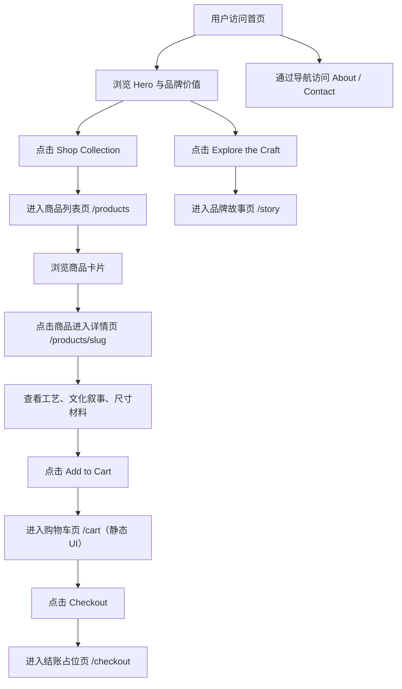

# 蔚纸东方 / Yuxian Paper Art — 产品需求文档

文档版本：v1.0
项目名称：蔚纸东方 / Yuxian Paper Art
仓库名：yuxian-paper-art
当前阶段：Phase 1 — 前台静态 MVP

---

## 1. 产品概述

构建一个面向海外用户的高端东方手工艺跨境电商独立站，第一阶段聚焦"蔚县剪纸"艺术品、家居装饰品、礼品和收藏品。

- **核心目标**：让用户感知这是一个有文化、有审美、有品位的手工艺品牌，而非廉价中国风纪念品站
- **目标用户**：海外家居装饰消费者、礼品购买者、中国文化兴趣用户、博物馆礼品店风格消费者
- **价值主张**：`Heritage Cut by Hand, Light Framed for Modern Homes.`（用手工剪出的非遗文化，用现代方式装进海外家庭的日常生活）

---

## 2. 核心功能

### 2.1 用户角色

| 角色 | 说明 |
|---|---|
| 浏览者（所有用户） | 浏览首页、商品列表、商品详情、品牌故事、关于我们、联系页 |
| 购物者（MVP 静态） | 查看购物车静态 UI、查看结账占位页 |

### 2.2 功能模块

1. **首页 `/`**：Hero 品牌区、品牌价值点、精选商品、工艺故事、礼品场景、Footer
2. **商品列表页 `/products`**：商品网格、商品卡片、分类筛选结构预留
3. **商品详情页 `/products/[slug]`**：大图视觉区、商品信息、工艺说明、文化叙事、Add to Cart
4. **品牌故事页 `/story`**：蔚县剪纸文化背景、工艺特点、品牌使命
5. **关于我们页 `/about`**：品牌使命、选品标准、对非遗的态度
6. **联系页 `/contact`**：联系表单 UI、邮箱占位、批量采购/礼品合作说明
7. **购物车页 `/cart`**：静态 UI（商品缩略图、名称、数量、价格、小计、总计）
8. **结账页 `/checkout`**：占位页，展示后续将接入的结账流程

### 2.3 页面详情

| 页面名称 | 模块名称 | 功能描述 |
|---|---|---|
| 首页 | Header | 品牌名 `Yuxian Paper Art`，导航 Shop/Story/About/Contact，Cart 入口 |
| 首页 | Hero | 品牌标题 `Heritage Cut by Hand, Light Framed for Modern Homes.`，副标题，双按钮 Shop Collection / Explore the Craft，右侧抽象纸艺视觉占位 |
| 首页 | Brand Values | 三个价值点卡片：Handcrafted Heritage / Meaningful Gifts / Ready for Modern Interiors |
| 首页 | Featured Products | 4 个精选商品卡片，含视觉占位、名称、副标题、价格、标签、详情入口 |
| 首页 | Craft Story | 蔚县剪纸工艺感、层次感、手工价值和文化价值叙事 |
| 首页 | Gift Occasions | 四个礼品场景：Housewarming / Wedding / Festival / Collector's Gift |
| 首页 | Footer | 品牌信息、导航链接、社交媒体占位、版权信息 |
| 商品列表页 | 页面标题与说明 | 艺术陈列风格标题，非货架式 |
| 商品列表页 | 商品网格 | 响应式网格布局，桌面 3-4 列，移动端 1-2 列 |
| 商品列表页 | 商品卡片 | 视觉占位、名称、副标题、价格、标签、详情入口 |
| 商品详情页 | 大图视觉区 | 抽象纸艺占位图，宣纸纹理 + 剪纸轮廓 + 朱红/古金点缀 |
| 商品详情页 | 商品信息区 | 标题、副标题、价格、短描述、Add to Cart 按钮 |
| 商品详情页 | 工艺与文化区 | 尺寸、材料、工艺说明、文化寓意、运输说明 |
| 商品详情页 | 推荐商品区 | 预留推荐商品区域 |
| 品牌故事页 | 文化叙事区 | 什么是蔚县剪纸、工艺特点、传统文化背景、手工价值 |
| 品牌故事页 | 现代关联区 | 为什么适合现代空间、为什么适合作为礼物、品牌使命 |
| 关于我们页 | 品牌介绍区 | 品牌使命、为什么做这个项目、如何选择产品、对非遗的态度 |
| 联系页 | 联系表单 UI | 静态表单（姓名、邮箱、消息），不接真实提交 |
| 联系页 | 合作说明区 | 批量采购说明、礼品合作说明、客服响应说明 |
| 购物车页 | 购物车静态 UI | 商品缩略图、名称、数量、单价、小计、总计、Checkout 按钮 |
| 结账页 | 占位信息 | 提示 "Checkout integration will be added in the next phase."，列出后续接入流程 |

---

## 3. 核心流程

---

## 4. 用户界面设计

### 4.1 设计风格

- **整体方向**：博物馆礼品店气质、东方纸艺、手工非遗、温润高级、克制安静、有诗意
- **主色**：`#F7F1E5`（宣纸米白背景）
- **深色文字**：`#171412`（墨黑）
- **辅助深棕**：`#3B2A1F`（导航、局部标题）
- **中国朱红**：`#B73A2F`（CTA 按钮、强调、少量装饰）
- **古金色**：`#C9A45C`（细线、标签、装饰点缀）
- **浅卡片色**：`#FFF9EF`（商品卡片、信息卡片背景）
- **边框浅色**：`#E7D8C3`（卡片边框、分割线）
- **排版**：大量留白，标题大字宽松行距，正文中等字号保证可读，避免过多字体层级
- **布局**：卡片式布局、轻边框轻阴影、商品像艺术品陈列而非货架
- **动效**：仅 hover 轻微上浮、阴影变化、按钮颜色过渡，不炫技
- **禁止**：淘宝风、低价促销风、满屏红色、赛博风、游戏风、过度动画、信息拥挤

### 4.2 页面设计概述

| 页面名称 | 模块名称 | UI 元素 |
|---|---|---|
| 首页 | Hero | 左右双栏（桌面），左文字右视觉占位，大标题 + 副标题 + 双按钮，米白背景 |
| 首页 | Brand Values | 三列卡片网格（桌面），图标 + 标题 + 描述，浅卡片色背景 |
| 首页 | Featured Products | 四列商品卡片网格（桌面），卡片含占位图 + 标签 + 名称 + 副标题 + 价格 |
| 首页 | Craft Story | 左右双栏（桌面），左文字叙事右抽象纸艺装饰，深棕标题 |
| 首页 | Gift Occasions | 四列场景卡片（桌面），每个场景含图标 + 场景名 + 简短描述 |
| 商品列表页 | 商品网格 | 响应式网格，桌面 3-4 列，卡片风格与首页统一 |
| 商品详情页 | 商品主区域 | 桌面双栏（左大图右信息），移动端上下堆叠，信息区含标题/价格/描述/按钮 |
| 商品详情页 | 工艺详情区 | 多卡片或列表展示尺寸/材料/工艺/运输/文化寓意 |
| 品牌故事页 | 故事内容区 | 纵向叙事布局，章节式排版，大量留白，文化感文字排版 |
| 购物车页 | 购物车列表 | 表格式布局（桌面），卡片式（移动），含缩略图/名称/数量/价格/总计 |
| 结账页 | 占位卡片 | 居中卡片，提示文字 + 后续流程列表 |

### 4.3 响应式设计

- **桌面端优先**：实现高级感布局，双栏/多栏网格，充足留白
- **移动端适配**：单列或双列网格，导航折叠，按钮足够大，文字可读，无横向滚动
- **断点**：使用 Tailwind 默认断点（sm: 640px, md: 768px, lg: 1024px, xl: 1280px）

---

## 5. MVP 验收标准

1. `npm install` 成功，`npm run dev` 成功
2. 8 个页面全部可访问，无白屏/404/控制台报错
3. 移动端布局不崩
4. 商品数据集中在 `src/data/products.ts`（6 个商品）
5. 组件拆分清晰，不把所有代码写在一个文件
6. 视觉符合高端东方手工艺定位
7. 产品详情页有文化叙事，不是普通商品参数页
8. 不接 Medusa、不接支付、不泄露密钥