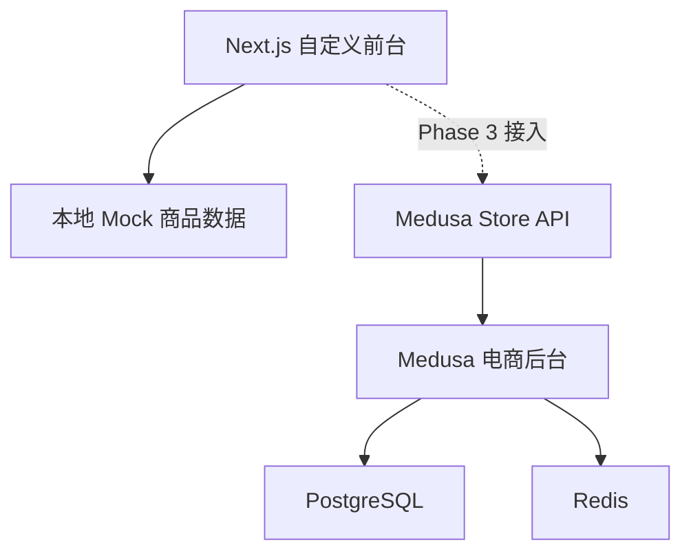

# 蔚纸东方 / Yuxian Paper Art — 技术架构文档

文档版本：v1.0
项目名称：蔚纸东方 / Yuxian Paper Art
适用阶段：Phase 1 — 前台静态 MVP

---

## 1. 架构设计



Phase 1 仅包含左侧链路：Next.js 前台直接从本地 Mock 数据读取商品信息，不接入任何后端服务。

---

## 2. 技术选型

| 模块 | 技术 | 版本要求 |
|---|---|---|
| 前端框架 | React | ^18 |
| 元框架 | Next.js（App Router） | ^14 |
| 语言 | TypeScript | ^5 |
| 样式方案 | Tailwind CSS | ^3.4 |
| 初始化工具 | create-next-app | latest |
| 数据源 | 本地 Mock 数据 | — |
| 部署 | Vercel / Node 服务 | — |

---

## 3. 路由定义

| 路由 | 文件路径 | 用途 |
|---|---|---|
| `/` | `src/app/page.tsx` | 首页 |
| `/products` | `src/app/products/page.tsx` | 商品列表页 |
| `/products/[slug]` | `src/app/products/[slug]/page.tsx` | 商品详情页 |
| `/story` | `src/app/story/page.tsx` | 品牌故事页 |
| `/about` | `src/app/about/page.tsx` | 关于我们页 |
| `/contact` | `src/app/contact/page.tsx` | 联系页 |
| `/cart` | `src/app/cart/page.tsx` | 购物车页 |
| `/checkout` | `src/app/checkout/page.tsx` | 结账占位页 |

---

## 4. 目录结构

```
yuxian-paper-art/
├─ apps/
│  └─ storefront/
│     ├─ src/
│     │  ├─ app/
│     │  │  ├─ layout.tsx              # 根布局（Header + Footer）
│     │  │  ├─ page.tsx                # 首页
│     │  │  ├─ globals.css             # Tailwind + 全局样式
│     │  │  ├─ products/
│     │  │  │  ├─ page.tsx             # 商品列表页
│     │  │  │  └─ [slug]/
│     │  │  │     └─ page.tsx          # 商品详情页
│     │  │  ├─ story/
│     │  │  │  └─ page.tsx             # 品牌故事页
│     │  │  ├─ about/
│     │  │  │  └─ page.tsx             # 关于我们页
│     │  │  ├─ contact/
│     │  │  │  └─ page.tsx             # 联系页
│     │  │  ├─ cart/
│     │  │  │  └─ page.tsx             # 购物车页
│     │  │  └─ checkout/
│     │  │     └─ page.tsx             # 结账占位页
│     │  ├─ components/
│     │  │  ├─ Header.tsx
│     │  │  ├─ Footer.tsx
│     │  │  ├─ Container.tsx
│     │  │  ├─ Button.tsx
│     │  │  ├─ SectionTitle.tsx
│     │  │  ├─ HeroSection.tsx
│     │  │  ├─ ProductCard.tsx
│     │  │  ├─ ProductGrid.tsx
│     │  │  ├─ ValueCard.tsx
│     │  │  ├─ CraftStory.tsx
│     │  │  └─ GiftOccasionCard.tsx
│     │  ├─ data/
│     │  │  └─ products.ts             # Mock 商品数据（6 个商品）
│     │  ├─ types/
│     │  │  └─ product.ts              # Product 类型定义
│     │  └─ lib/
│     │     └─ utils.ts                # 通用工具函数
│     ├─ public/
│     ├─ package.json
│     ├─ tailwind.config.ts
│     ├─ tsconfig.json
│     ├─ next.config.js
│     └─ .env.example
├─ docs/                                # 项目规划文档
├─ README.md
├─ AGENTS.md
└─ .gitignore
```

---

## 5. 数据模型

### 5.1 Product 类型定义

```typescript
export type Product = {
  id: string
  slug: string
  name: string
  subtitle: string
  price: number
  currency: 'USD'
  category: string
  imagePlaceholder: string
  shortDescription: string
  description: string
  dimensions: string
  materials: string
  craft: string
  shippingNote: string
  tags: string[]
}
```

### 5.2 MVP 首批商品（6 个）

| ID | Slug | 名称 |
|---|---|---|
| 1 | red-lantern-blessing | Red Lantern Blessing Paper Cut |
| 2 | peony-window | Peony Window Paper Art |
| 3 | auspicious-dragon | Auspicious Dragon Heritage Cut |
| 4 | folk-opera-shadow | Folk Opera Shadow Paper Cut |
| 5 | zodiac-rabbit | Zodiac Rabbit Paper Cut |
| 6 | double-happiness-wedding | Double Happiness Wedding Paper Cut |

---

## 6. 组件分层设计

| 层级 | 位置 | 职责 |
|---|---|---|
| 页面层 | `src/app/` | 定义路由、组合组件、处理页面级 metadata |
| 组件层 | `src/components/` | 纯 UI 展示，接收 props，不处理业务逻辑 |
| 数据层 | `src/data/` | 存放 Mock 商品数据，作为后续 Medusa 不可用时的 fallback |
| 类型层 | `src/types/` | TypeScript 类型定义 |
| 工具层 | `src/lib/` | 通用工具函数 |

组件职责原则：
- 页面组件不直接散落数据请求
- UI 组件不承担复杂业务逻辑
- Mock 数据集中管理，不在多个页面重复定义

---

## 7. Tailwind 色彩配置

```typescript
// tailwind.config.ts 扩展色板
colors: {
  parchment: '#F7F1E5',      // 背景主色
  ink: '#171412',            // 深色文字
  walnut: '#3B2A1F',         // 辅助深棕
  vermilion: '#B73A2F',      // 中国朱红
  gold: '#C9A45C',           // 古金色
  cream: '#FFF9EF',          // 浅卡片色
  sand: '#E7D8C3',           // 边框浅色
}
```

---

## 8. 环境变量

前台 `.env.example`：

```env
NEXT_PUBLIC_SITE_URL=http://localhost:3000
```

Phase 1 仅需此变量，后续 Phase 3 接入 Medusa 时增加 `NEXT_PUBLIC_MEDUSA_BACKEND_URL`。

---

## 9. 开发阶段顺序

```
Phase 1（当前）：前台静态 MVP → 先跑通品牌体验和页面结构
Phase 2：Medusa 后台基础接入 → 初始化后台 + PostgreSQL + Redis
Phase 3：前台接入 Medusa 商品数据 → API 对接 + fallback 机制
Phase 4-8：购物车、结账、支付、SEO、运营增强
```

---

## 10. 本地开发端口

| 服务 | 端口 |
|---|---|
| Next.js 前台 | `http://localhost:3000` |
| Medusa 后台（Phase 2） | `http://localhost:9000` |
| PostgreSQL（Phase 2） | `localhost:5432` |
| Redis（Phase 2） | `localhost:6379` |